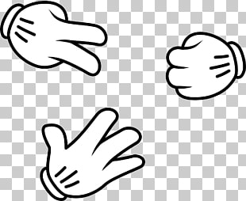

# Paper, Rock, Scissors JS

 
This is a quick and dirty implementation of the game Paper, Rock, Scissors in Javascript. The game will load the options on the document load, and player must choose their move and face off against the computer's random choice.

You can see the game in action at [HERE](https://roncodes.github.io/paper-rock-scissors-js/ "HERE")

